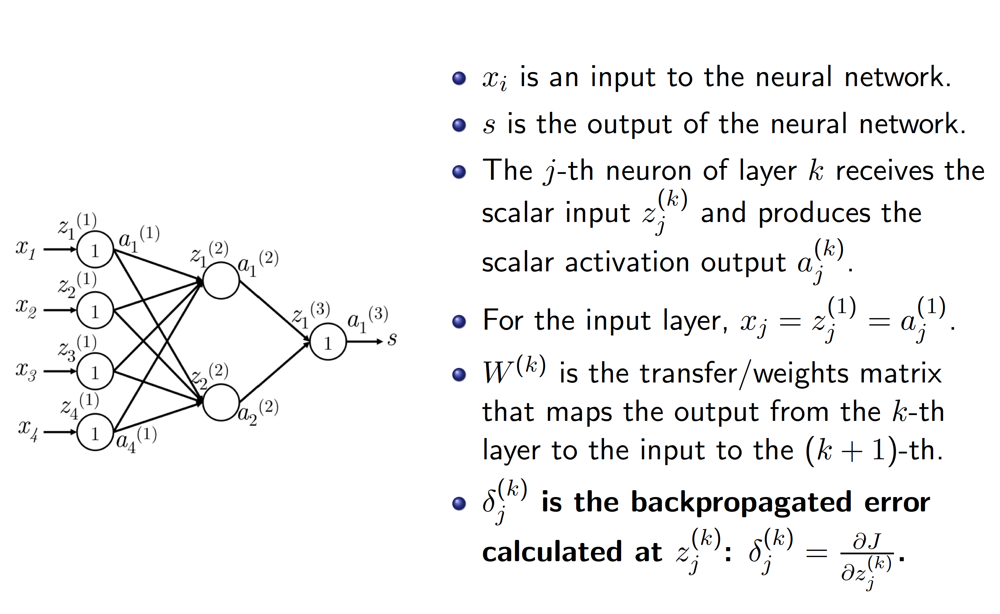
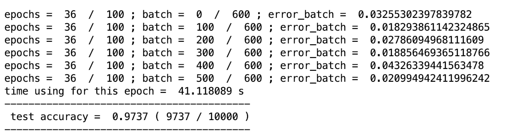
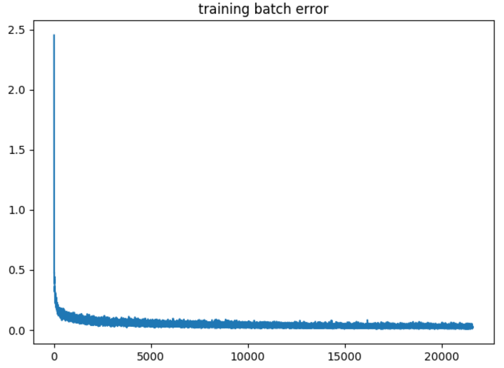
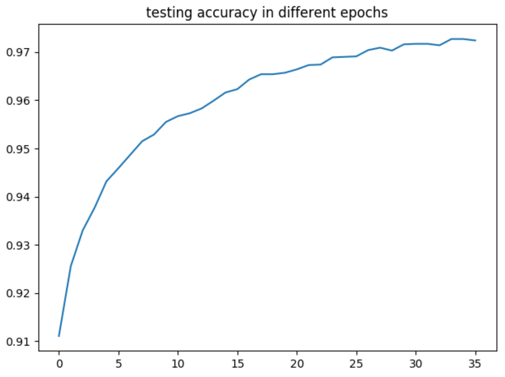

## NN for handwriting recognition from pure numpy

## Steps

Step1. reading the images and the labels
Step2. Setting learning rate, dropout fraction, epoches and batchs
Step3. Setting activation function (Sigmoid)
Step4. Calculating the nn fowardings
Step5. Calculating the nn back propogations

Step5, Refresh nn and the gradients
Step6. Statistics of accuracy and batch regressions

## Test results

